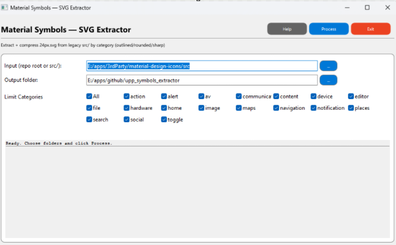

# Material Symbols – SVG Extractor (src → per-category headers)

> Extracts **24px** Material Icons (legacy `src/` layout), minifies → zlib-compresses → Base64-encodes each SVG, and emits **one C++ header per category**. Intended for fast, dependency-free inclusion in apps that preview/export icons.



## TL;DR

* Point **Input** at the Material Icons **`src/`** tree (or the repo root).
* Pick **Output**.
* Tick the **categories** you want.
* Click **Process** → get `icons_<category>.h` files with small, lazy-decodable blobs.

---

## How it works

* Scans `src/<category>/<icon>/<style>/24px.svg`
* Supports **three styles** in the legacy tree:

  * `materialiconsoutlined` → `OUTLINED`
  * `materialiconsround` → `ROUNDED`
  * `materialiconssharp` → `SHARP`
* **Early category filtering**: non-selected categories are skipped before any deep scan.
* Emits one header per category with:

  * a format marker: `FORMAT: KICONS_V1_NO_DECODERS`
  * `enum Style` and `struct BaseSVGIcon`
  * a `kIcons[]` table with all icons from that category
* **No per-icon decode functions** are generated—decoding is one line:

  ```cpp
  String svg = ZDecompress(Base64Decode(icon.b64zIcon));
  ```

### Output header shape (example: `icons_action.h`)

```cpp
// Auto-generated by Material Symbols SVG Extractor (v0.9)
// FORMAT: KICONS_V1_NO_DECODERS
// Category: action
// Location: E:/apps/3rdParty/material-design-icons/src/action/
// Each icon is Base64(zlib(minified-SVG)). Decode with ZDecompress(Base64Decode(...)).

#ifndef UPP_MATERIAL_SYMBOLS_ICONS_ACTION_H
#define UPP_MATERIAL_SYMBOLS_ICONS_ACTION_H

#include <Core/Core.h>
#include <plugin/z/z.h>

namespace action {

using namespace Upp;

enum Style : uint8 { OUTLINED = 0, ROUNDED = 1, SHARP = 2 };

struct BaseSVGIcon {
    const char* category;   // "action"
    Style       style;      // OUTLINED/ROUNDED/SHARP
    const char* name;       // "account_balance_wallet", etc.
    const char* source;     // src/action/<icon>/<style-dir>/24px.svg
    const char* b64zIcon;   // Base64(zlib(minified-SVG))
};

// … many static const char action_<style>_<name>_b64z[] blobs …

static const BaseSVGIcon kIcons[] = {
    { "action", OUTLINED, "account_balance_wallet", "src/action/account_balance_wallet/materialiconsoutlined/24px.svg", action_outlined_account_balance_wallet_b64z },
    // ...
};

static const int kIconCount = (int)(sizeof(kIcons)/sizeof(kIcons[0]));

} // namespace action
#endif
```

---

## Requirements

* **Ultimate++ / U++** (tested with build **r17810** + Clang on Windows).
  Any reasonably recent U++ should work; the code uses Core/CtrlLib/Draw/Painter + `plugin/z`.
* Material Icons **legacy** repo with the `src/` tree (not the newer “symbols” tree).

> Tip: keep the upstream license file from the icons repo with your distribution and respect Google’s licensing for Material Icons.

---

## Building

### Using TheIDE (U++)

1. Open the package `upp_symbols_extractor` in **TheIDE**.
2. Select a kit (e.g., Clang or MSVC).
3. Build & Run.

### Paths (debug defaults)

* **Input**: `E:/apps/3rdParty/material-design-icons/src`
* **Output**: `E:/apps/github/upp_symbols_extractor`

Change those in the UI or in code if you want different defaults.

---

## Using the headers in your app

Include one or multiple category headers:

```cpp
#include "icons_action.h"
#include "icons_alert.h"
// …

using namespace Upp;

// Example: iterate a category and render an icon with U++ SvgImg
for (int i = 0; i < action::kIconCount; ++i) {
    const action::BaseSVGIcon& ic = action::kIcons[i];
    String svg = ZDecompress(Base64Decode(ic.b64zIcon));
    Image img = SvgImg::FromString(svg, Size(24, 24));
    // … draw img, export, etc.
}
```

Combine categories in a simple aggregate:

```cpp
// catalog.h
#include "icons_action.h"
#include "icons_alert.h"
// …

namespace catalog {
    struct View { const void* table; int count; }; // “void*” to avoid repeating the struct per ns
    inline const Vector<View>& All() {
        static Vector<View> v;
        if (v.IsEmpty()) {
            v.Add({ action::kIcons, action::kIconCount });
            v.Add({ alert::kIcons,  alert::kIconCount  });
            // …
        }
        return v;
    }
}
```

If you want a single, global index by **(category, style, name)**:

```cpp
struct Key {
    String cat; int style; String name;
    bool operator==(const Key& b) const { return cat == b.cat && style == b.style && name == b.name; }
    dword GetHashValue() const { return CombineHash(GetHashValue(cat), CombineHash(style, GetHashValue(name))); }
};

Index<Key> idx;
Vector<const char*> payloads;

void BuildIndex() {
    for (const auto& view : catalog::All()) {
        // Each view.table is actually <cat>::kIcons with the same layout:
        const auto* icons = static_cast<const action::BaseSVGIcon*>(view.table);
        for (int i = 0; i < view.count; ++i) {
            const auto& ic = icons[i];
            idx.Add({ ic.category, (int)ic.style, ic.name });
            payloads.Add(ic.b64zIcon);
        }
    }
}
```

---

## Category filtering & logging

* The UI presents **checkboxes** for all known categories (+ an **All** toggle).
* During processing we **early-filter**: if a category isn’t selected, we never descend into its icons/styles.
* The status panel streams:

  * selected categories → `processing… DONE` (or `ERROR`)
  * non-selected categories → `skipped (filtered)`
  * warnings for missing or unreadable `24px.svg`

---

## Performance notes

* Each SVG is **minified once**, then **zlib-compressed** and **Base64-encoded**.
* At runtime, decode is **lazy and cheap**—one `ZDecompress(Base64Decode(...))` call.
* One header per category avoids enormous single-file translation units while still allowing selective inclusion.

---

## Troubleshooting

* **“Please select the repository root or the 'src' folder.”**
  Point **Input** to the repo root (containing `src/`) or directly to the `src/` folder.
* **No icons found**
  Only `24px.svg` is read. Other sizes are ignored by design.
* **Styles missing**
  Only `materialiconsoutlined|round|sharp` are supported from the legacy `src/` tree. Baseline `materialicons` is skipped.

---

## Credits

* Material Design Icons by Google — see the upstream repo for attribution and license.
* Built with **Ultimate++**.

## License

* This tool: MIT
* **Icons**: governed by Google

---

# Development summary & next step (IconPickerApp)

### What we built

* A focused extractor that:

  * Walks the **legacy `src/` layout**.
  * **Early-filters** categories from the UI.
  * Emits compact, **self-sufficient** headers per category with a stable table shape:

    ```cpp
    enum Style : uint8 { OUTLINED, ROUNDED, SHARP };
    struct BaseSVGIcon { const char* category; Style style; const char* name; const char* source; const char* b64zIcon; };
    extern const BaseSVGIcon kIcons[];
    extern const int kIconCount;
    ```
  * Uses an obvious **format marker** (`FORMAT: KICONS_V1_NO_DECODERS`) and **atomic writes** (`.tmp` → move).

### Intent

* Provide a **zero-dependency**, compile-time bundle of icons that’s:

  * Fast to link in tools,
  * Easy to index and search,
  * Easy to render/export in **IconPickerApp**.

Enjoy,
Curtis
